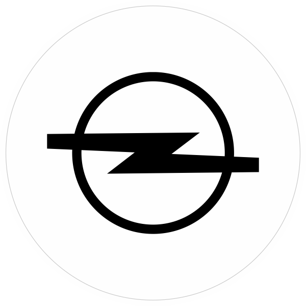

<p align="center">
  
</p>

# Opel Bot

Simple Discord bot that handles webhooks for the Opel-Vauxhall server.

New Reddit posts on certain subreddits and new RSS feed articles from Opel Post are submitted to a news channel.

## Env variables

Create an .env file in the root of the folder to spin up the bot with the following variables:

```
TOKEN=yourapptoken
CLIENT_ID=yourappclientid
GUILD_ID=serverid
PORT=expressport
NEWS_CHANNEL=channelid
```
